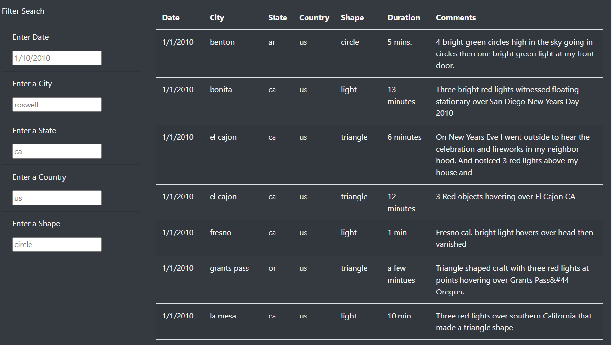
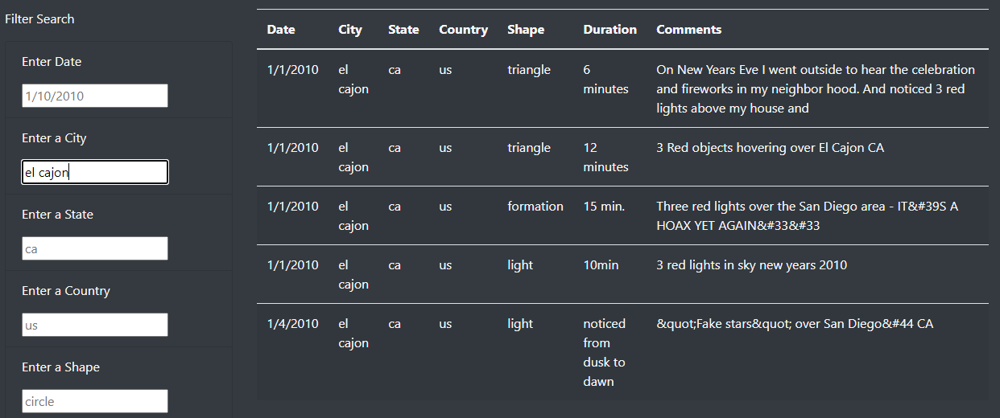
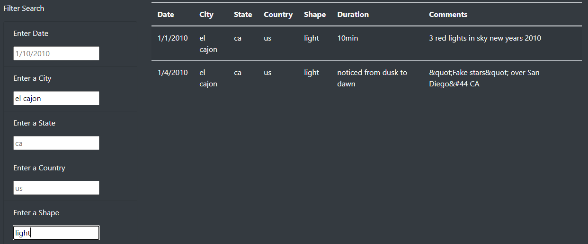
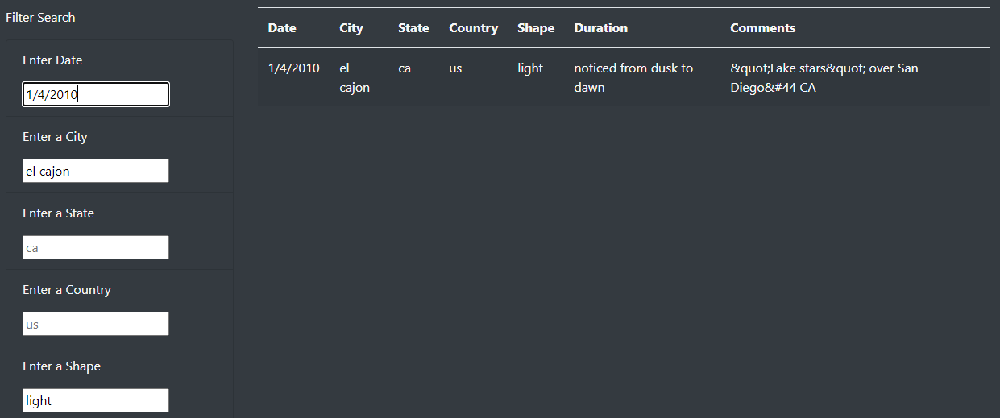

# Washinton University Data Analytics Boot Camp Module 11 Challenge

## Overview of Project

This project analyzed UFO events using a series of search criteria, including the date, location (city, state, country), and shape of observed UFO. Search criteria can also be stacked to narrow down the list.

## Results

When all search criteria are left empty, the search result returns to the entire list as shown below.
 

Single criterion can be added to narrow down the search by entering strings in the corresponding cell. For example, if "el cajon" is entered under "Enter a City", the returned list is shortened to show only the observations made in the city of El Cajon as shown below.
 

Multiple search criteria can be stacked to further narrow down the search. In the following exmaple, besides "el cajon" was entered as city name, the UFO shape was also entered as "light", which returned two search results.
 

The next example further stacked the criterion for the observation date, which returned only one search result.
 

## Summary

While the returned search list successfully updates according to the search criteria, two additional features can improve the user experience. For example, the search criteria are case-sensitive, and they have to be lower cases due in this case. This can be confusing for users when they input the names of city, state, and country. A conversion of the input string to lower cases in the .js file can improve user experience. 
 

Another feature that is good to include is to clear the existing search criteria with a single click on a button, so that users do not have to clear the inputs in each cell.